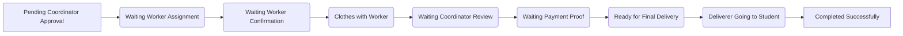

# 🚀 Smart Wash Hub – University Laundry Management System


A full-featured, production-ready laundry management platform for universities — manage orders, workers, deliveries, and finances in one place.

---

## 🌟 Features

- 🔐 Role-based dashboards: Student, Coordinator, Worker, Deliverer, Admin  
- 🧺 Complete laundry order workflow (request → delivery)  
- ⚡ Real-time notifications (WebSocket-ready)  
- 🌗 Dark/Light mode with saved preferences  
- 📱 Fully responsive UI (mobile → desktop)  
- 📥 Payment proof uploads, ⭐ ratings for staff, 🧾 analytics & reports

---

## 👥 Dashboards Breakdown

| Role | Key Capabilities |
| :--- | :--- |
| **🎓 Student** | Create orders, track progress, upload payment receipt, view history, rate staff |
| **🗂 Coordinator** | Approve/reject orders, assign workers/deliverers, view audit logs, monitor completion |
| **🔧 Worker** | Accept/reject tasks, confirm pickup, upload completion photos, track performance |
| **🚚 Deliverer** | Manage delivery tasks, start routes, confirm final delivery, view stats |
| **👑 Admin** | Manage users (CRUD), system-wide order management, revenue & finance reports |

---

## 🔄 Order Status Workflow

The system manages the lifecycle of an order through these stages:



---

## 🛠️ Tech Stack

| Category | Technologies |
|---------:|--------------|
| Frontend | Next.js 16 (App Router), React 19, TailwindCSS v4 |
| Backend  | Next.js Server Actions, Node.js |
| Database | MySQL |
| Auth     | JWT, Secure Cookies, Middleware |
| Storage  | Cloudinary (images, payment proof) |
| Realtime | Pusher / WebSockets |
| UI/UX    | Framer Motion, ShadCN UI |

---

## 📸 Screenshots

Place screenshots in /public/screenshots and reference them like:

```md


```

---

## 📦 Installation & Setup

1. Clone the repository

```bash
git clone https://github.com/urjiiko1/v0-smart-wash-hub.git
cd v0-smart-wash-hub
```

2. Install dependencies

```bash
npm install
```

3. Setup environment variables

Create a file named .env.local in the project root and add the variables below:

| Variable | Description |
| :--- | :--- |
| MONGO_URI | MongoDB connection string |
| JWT_SECRET | Secret for signing JWTs |
| CLOUDINARY_CLOUD_NAME | Cloudinary cloud name |
| CLOUDINARY_API_KEY | Cloudinary API key |
| CLOUDINARY_API_SECRET | Cloudinary API secret |
| PUSHER_APP_ID | Pusher App ID |
| PUSHER_KEY | Pusher key |
| PUSHER_SECRET | Pusher secret |
| PUSHER_CLUSTER | Pusher cluster (e.g., mt1) |

Example .env.local:

```ini
MONGO_URI="your_mongodb_connection_string"
JWT_SECRET="your_long_random_secret"

CLOUDINARY_CLOUD_NAME="xxxx"
CLOUDINARY_API_KEY="xxxx"
CLOUDINARY_API_SECRET="xxxx"

PUSHER_APP_ID="xxxx"
PUSHER_KEY="xxxx"
PUSHER_SECRET="xxxx"
PUSHER_CLUSTER="mt1"
```

4. Run development server

```bash
npm run dev
```

5. Open the app

Visit: http://localhost:3000

---

## 🧑‍💻 Contributing

We welcome contributions! To get started:

1. Fork the repository.
2. Create a new branch (`git checkout -b feature/your-feature`).
3. Commit your changes.
4. Push to your fork and submit a pull request.

Please follow the [Contributing Guidelines](CONTRIBUTING.md) for code style and best practices.

---

## ❓ FAQ

**Q: Is this system production-ready?**  
A: Yes, it is designed for deployment in university environments.

**Q: Can I use a different database?**  
A: The system is built for MongoDB, but you can adapt it for other databases with some changes.

**Q: How do I report bugs or request features?**  
A: Open an issue on the [GitHub Issues](https://github.com/urjiiko1/v0-smart-wash-hub/issues) page.

---

## 📃 License

This project is licensed under the MIT License. See [LICENSE](LICENSE) for details.

---

If you add screenshots or other assets, commit them to /public/screenshots and update references accordingly.